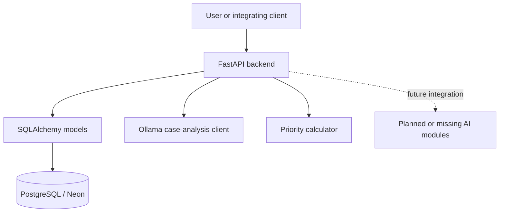

<div align="center">

# CareHaven AI

### Turning Every Contribution Into Smarter Impact

An AI-assisted humanitarian aid and donation platform for structuring cases, supporting review, connecting donors with needs, and grounding humanitarian knowledge workflows.

[](https://www.python.org/)
[](https://fastapi.tiangolo.com/)
[](https://www.sqlalchemy.org/)
[](https://ollama.com/)

</div>

> **Current status:** backend foundation and API modules are present, but this checkout is not yet a complete reproducible release. Several AI modules and dependency manifests referenced by earlier project work are currently absent and are called out below.

## Project Snapshot

| Area | Verified current state |
|---|---|
| Backend | FastAPI app in `backend/main.py` with auth, case, donation, and AI routers |
| Database | SQLAlchemy engine/session foundation for PostgreSQL/Neon |
| Models | User, case, donor, donation, evidence, analysis, and flag models |
| Case analysis | Ollama client in `ai/llm/` plus Pydantic result schemas |
| Priority | Rule-based calculator in `ai/priority/priority_engine.py` |
| RAG | Partial: generator entry point remains, but supporting retrieval modules are missing in this checkout |
| Recommendation | Not present in the current checkout |
| Anomaly detection | Not present in the current checkout |
| Frontend | No Streamlit or React application is present |

## The Product Idea

CareHaven is designed around a transparent humanitarian-support lifecycle:

```text
Understand -> Verify -> Prioritize -> Match -> Support -> Track
```

The intended system helps organize case information and produce reviewable signals. AI is decision support; it should not replace human judgment, determine eligibility automatically, or accuse people of fraud.

## Current Architecture



The FastAPI entry point is `backend/main.py`. The current API imports routers for authentication, cases, donations, and AI operations. The database layer intentionally uses the existing PostgreSQL/Neon schema and does not create tables automatically.

## Implemented Backend Foundation

- SQLAlchemy engine, session factory, declarative base, and database dependency.
- PostgreSQL/Neon mappings for cases, donors, donations, and case evidence.
- Application models for users, AI analyses, and review flags.
- Pydantic schemas for authentication, cases, donations, and AI responses.
- FastAPI routers and services for the current backend workflows.
- Environment-based settings with Ollama defaults.

## AI Components

### Ollama case analysis

`ai/llm/client.py` provides an injectable, non-streaming Ollama client. It sends case data to `/api/generate`, validates the JSON response, and returns a structured case-analysis schema. The configured defaults are `http://localhost:11434` and `qwen3:4b`.

### Priority scoring

`ai/priority/priority_engine.py` contains the current explainable rule-based calculator. It uses severity, urgency, affected people, funding gap, and emergency assistance category to produce a score, priority level, and reasons.

### RAG, recommendation, and anomaly work

Earlier project work described semantic RAG, ChromaDB, BM25/RRF hybrid retrieval, donor recommendation, and anomaly detection. Those implementation files are **not present in the current checkout** beyond the remaining RAG package initializer/generator references. They should not be treated as runnable from this branch until restored and validated.

## Data

The repository contains synthetic project data and trusted document inputs:

- `data/raw/cases/cases.csv`
- `data/raw/donors/donors.csv`
- `data/raw/donations/donations.csv`
- `data/raw/case_evidence_manifest.csv`
- `data/raw/documents/case_evidence/`
- `data/raw/documents/rag/ifrc_emergency_needs_assessment_and_planning_2025.pdf`
- `data/raw/documents/rag/metadata.csv`
- `data/external/disaster_images/` for the separate disaster-image reference dataset

The data is documented as synthetic or external reference material. The external image collection is not the same thing as user-submitted case evidence.

## Quick Start

### Create an environment

```powershell
python -m venv .venv
.venv\Scripts\Activate.ps1
```

### Configure secrets and database access

Copy `.env.example` to `.env` and provide a PostgreSQL/Neon connection string. Never commit `.env`.

| Variable | Purpose | Default / requirement |
|---|---|---|
| `DATABASE_URL` | PostgreSQL/Neon connection | Required by backend settings |
| `SECRET_KEY` | Authentication signing secret | Set a private value |
| `ACCESS_TOKEN_EXPIRE_MINUTES` | Token lifetime | `60` |
| `OLLAMA_BASE_URL` | Local Ollama server | `http://localhost:11434` |
| `OLLAMA_MODEL` | Ollama model | `qwen3:4b` |

The current checkout has no root `requirements.txt`, `pyproject.toml`, or `requirements/person2.txt`. Dependencies must therefore be restored or declared before a fresh setup is reproducible.

### Run the API

Once the backend dependencies are available:

```powershell
uvicorn backend.main:app --reload
```

The current repository does not contain a verified frontend startup command.

### Run Ollama case analysis

Install Ollama separately, start the local service, and make the configured model available:

```powershell
ollama list
ollama run qwen3:4b
```

## Testing

The repository contains backend and RAG test files, but the current checkout does not collect cleanly because required implementation/dependency files are missing. The intended commands are:

```powershell
python -m pytest -q
python -m compileall backend ai
```

Run focused tests when their imported implementation modules are present:

```powershell
python -m pytest tests/backend -q
python -m pytest tests/rag -q
```

Current known collection blockers include missing RAG modules such as `ai.rag.chunking` and an unavailable PostgreSQL driver in the default interpreter used during the audit.

## Project Structure

```text
Care-Haven/
├── ai/
│   ├── llm/              Ollama case-analysis client and schemas
│   ├── priority/         Explainable priority calculator
│   ├── rag/              Partial RAG package in current checkout
│   ├── recommendation/   Directory currently without implementation files
│   └── anomaly/          Directory currently without implementation files
├── backend/
│   ├── core/             Settings, database, and security foundation
│   ├── models/           SQLAlchemy models
│   ├── routers/          FastAPI routers
│   ├── schemas/          Pydantic schemas
│   └── services/         Backend services
├── data/                 Synthetic, trusted-document, and external reference data
├── scripts/              Data utilities and RAG demo script
├── tests/                Backend and AI test suites
├── .env.example          Secret-free configuration template
└── README.md
```

Generated caches, virtual environments, model artifacts, and local vector-store files should remain ignored and must not be committed.

## Project Status

### Implemented

- FastAPI application entry point and current routers.
- SQLAlchemy database foundation and model mappings.
- Pydantic request/response schemas.
- Ollama case-analysis client with structured response validation.
- Explainable rule-based priority calculation.
- Synthetic datasets and trusted IFRC document inputs.

### In progress

- Restoring and integrating the complete RAG implementation.
- Restoring recommendation and anomaly modules.
- Making dependency installation reproducible.
- Completing end-to-end backend validation.

### Planned / future

- Streamlit or React frontend.
- Production evidence/object storage.
- Broader verified humanitarian knowledge sources.
- Additional computer-vision workflows.
- Deployment automation and unified dependency management.

## Human-in-the-Loop Safety

```text
AI signal
   |
   v
Flag or recommendation
   |
   v
Human review
   |
   v
Final decision
```

CareHaven should surface evidence, explanations, and uncertainty for human reviewers. It should not automatically reject assistance or label a person fraudulent. Keep credentials in environment variables and avoid exposing sensitive humanitarian information in logs or source control.

## Team Scope

| Area | Responsibility |
|---|---|
| Backend and database | FastAPI, PostgreSQL/Neon, models, authentication, APIs, and services |
| AI / ML | LLM, RAG, priority, recommendation, anomaly, and future vision work |
| Integration and frontend | Future Streamlit or React interface |

## Roadmap

- **MVP:** restore the complete dependency and AI-module baseline, then validate backend workflows end to end.
- **Next:** integrate AI modules with backend services and add a user-facing frontend.
- **Future:** production storage, broader knowledge sources, richer analytics, multilingual support, and deployment automation.

## License

This project is currently developed as an academic/graduation project. No open-source license has been declared yet.
